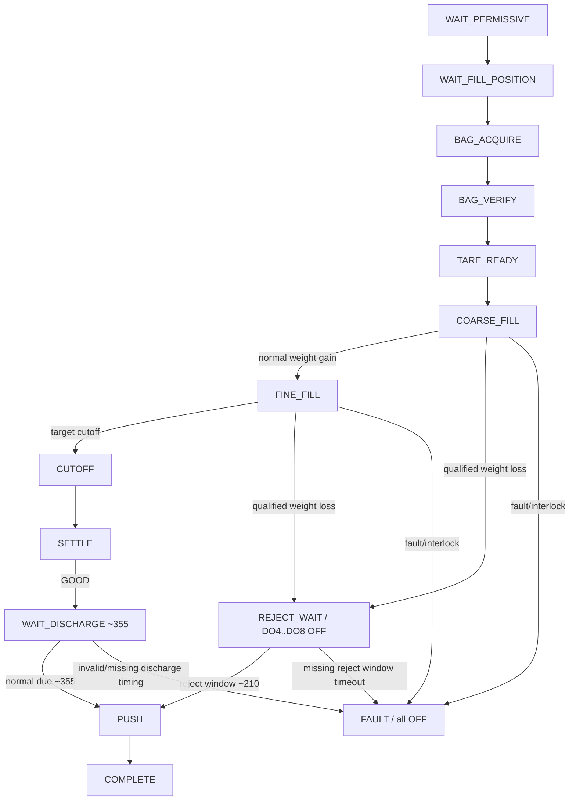
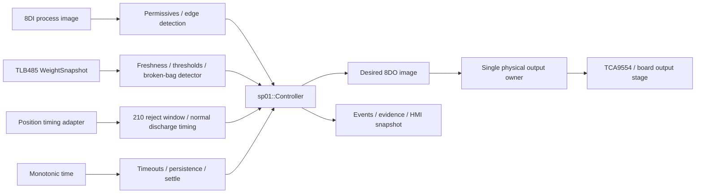

# SP01 Canonical Engineering Views

Status: canonical working view pack for commissioning branch `diag/sp01-g2-g9`.

This file is the compact source of truth for the 13 engineering views used by firmware, HMI, commissioning and long-term maintenance. Historical Yellow/Purple/Red team material is design input only.

## Ground-truth precedence

When two representations disagree, use this order:

```text
1. measured installed-machine electrical/mechanical evidence
2. executable C++ controller + board adapter
3. frozen I/O / weighing / topology contracts
4. this canonical view pack
5. generated HMI/diagram projections
6. historical team proposals
```

Current installed-process truths used here:

```text
controller       ESP32-S3 / ESP-IDF / C++17 / FreeRTOS
one controller   one spout; SP01 is not master of SP02..SP08
weight           load cell -> LAUMAS TLB485 -> isolated RS485 -> WeightSnapshot
I/O              8DI + 8DO; no continuous-weight DI
broken bag       qualified net-weight decrease while filling is active
on broken bag    immediately remove DO4..DO8 filling energy
reject route     latch REJECT -> push/eject near 210 deg -> no later 355 deg push
good route       skip 210 deg -> normal push/eject near 355 deg
push actuator    semantic DO3 = bag.push for both routes
cloud/HMI        supervisory only; never owns cutoff/interlock/eject timing
```

Numeric detector thresholds, the exact 210/355 timing windows and actuator lead remain commissioning values until G4/G8 evidence freezes them.

---

## V1 — Runtime Timeline

Purpose: one monotonic evidence axis for control, weighing, I/O and bag disposition.

Canonical row:

```text
t_us | spout_id | cycle_id | mode | state | fault | disposition |
DI[7:0] | desired_DO[7:0] | physical_DO[7:0] |
weight_kg | weight_quality | stable | event
```

Required events include:

```text
boot / reset_reason
state_enter
DI_change / DO_change
weight_sample / weight_stale / weight_recovered
coarse_to_fine / normal_cutoff
broken_bag_candidate / broken_bag_detected
fill_energy_off
reject_latched
reject_window / reject_push_on / reject_push_off
normal_discharge_ref_a / ref_b / normal_push_on / normal_push_off
complete / fault / fault_clear
network_link_down / network_link_up
```

For REJECT evidence the ordering must be visible:

```text
negative-weight condition -> detector accepted -> DO4..DO8 OFF -> REJECT latched
-> ~210 deg reject window -> DO3 pulse -> no ~355 deg pulse
```

For GOOD evidence:

```text
normal fill -> settle -> no ~210 deg pulse -> normal ~355 deg DO3 pulse
```

---

## V2 — State / Process Matrix

Purpose: primary human-readable sequential logic view. It must match `sp01::Controller`.

| State | Main condition / transition | Main output behavior |
|---|---|---|
| `WAIT_PERMISSIVE` | wait for AUTO permissives or MANUAL request | all OFF |
| `WAIT_FILL_POSITION` | AUTO armed fill-position edge -> `BAG_ACQUIRE` | all OFF |
| `BAG_ACQUIRE` | bag present -> `BAG_VERIFY`; timeout -> fault | scanner + bag-detect air |
| `BAG_VERIFY` | verified bag -> `TARE_READY` | scanner + bag-detect air |
| `TARE_READY` | fresh GOOD weight -> `COARSE_FILL` | scanner + bag-detect air |
| `COARSE_FILL` | normal: weight >= coarse threshold -> `FINE_FILL`; broken-bag detector -> `REJECT_WAIT` in AUTO | A+B+C dosing + filling motor + aeration; detector decision removes DO4..DO8 immediately |
| `FINE_FILL` | normal: cutoff threshold -> `CUTOFF`; broken-bag detector -> `REJECT_WAIT` in AUTO | A+C dosing + filling motor + aeration; detector decision removes DO4..DO8 immediately |
| `CUTOFF` | immediate -> `SETTLE` | fill energy OFF |
| `SETTLE` | stable after minimum settle -> GOOD; MANUAL `COMPLETE`, AUTO `WAIT_DISCHARGE` | fill energy OFF |
| `REJECT_WAIT` | REJECT latched; wait semantic reject window near 210 deg -> `PUSH`; timeout -> fault | DO4..DO8 OFF; DO3 OFF until reject window |
| `WAIT_DISCHARGE` | GOOD only; normal A/B timing -> due -> `PUSH` | fill energy OFF |
| `PUSH` | AUTO DO3 pulse for current disposition | bag.push only |
| `COMPLETE` | cycle complete; next cycle resets disposition | all OFF |
| `FAULT` | latched controller/measurement fault | all OFF |

Disposition model:

```text
UNDECIDED during active filling
GOOD after successful normal settle
REJECT immediately when broken-bag detector is accepted
```

`REJECT` is a controlled bag disposition, not automatically a controller-wide fault.

---

## V3 — Interlock / Routing Flow

Purpose: explain allowed paths and first blocking condition.



The HMI should highlight the active node, active disposition and first blocking interlock.

---

## V4 — Interlock Predicates

Purpose: compact review equations only; not a second controller implementation.

```text
AUTO_PERMISSIVE = DI1 & DI2 & DI3 & DI4
MANUAL_REQUEST  = DI1 & DI4
BAG_PRESENT     = DI6
WEIGHT_FRESH    = quality==GOOD && age<=weight_stale_us
CUTOFF_REACHED  = net_kg >= target_kg - cutoff_margin_kg

BROKEN_BAG_CANDIDATE = state in {COARSE_FILL,FINE_FILL}
                       && weight_fresh
                       && qualified finite-window loss >= configured trip
                       && persistence satisfied

REJECT_PUSH_ALLOWED = disposition==REJECT && reject_window
NORMAL_PUSH_ALLOWED = disposition==GOOD && normal_discharge_due
```

State-derived output rules:

```text
COARSE: DO4+DO5+DO6+DO7+DO8 ON
FINE:   DO4+DO6+DO7+DO8 ON
REJECT detector accepted: DO4..DO8 OFF in the same controller decision
PUSH:   DO3 ON only in AUTO and only after the selected eject path is due
FAULT:  all outputs safe image
```

No Karnaugh map is canonical for this timed sequential machine.

---

## V5 — Logic Dependency Graph

Purpose: show authority boundaries.



Network/HMI tasks consume state; they do not own physical process outputs.

---

## V6 — Executable Engine / Ground Truth

Canonical executable files:

```text
firmware/esp32-s3/components/controller/include/sp01/model.hpp
firmware/esp32-s3/components/controller/include/sp01/controller.hpp
firmware/esp32-s3/components/controller/controller.cpp
```

Current executable reject model includes:

```text
BagDisposition {UNDECIDED, GOOD, REJECT}
State::RejectWait
PositionSnapshot.reject_window
broken-bag finite-window/high-water loss detector
same-tick transition from fill state to RejectWait
DO4..DO8 removed by RejectWait output image
DO3 only when reject_window becomes true
normal A/B discharge path remains separate for GOOD bags
```

The broken-bag detector defaults disabled until measured G4/G8 configuration values are supplied. This prevents invented thresholds from becoming production authority.

Python/host simulation is conformance/reference only, not production control authority.

---

## V7 — Physical I/O / Terminals

Canonical board map remains `BOARD_TERMINALS.md`.

```text
DI1 hopper.feeder_running
DI2 downstream.conveyor_ready
DI3 machine.motor_running
DI4 process.initiative
DI5 cycle.fill_position
DI6 bag.present
DI7 position.discharge_ref_a
DI8 position.discharge_ref_b

DO1 scanner.down
DO2 bag_detect_air
DO3 bag.push
DO4 dosing.valve_a
DO5 dosing.valve_b
DO6 dosing.valve_c
DO7 filling.motor
DO8 spout.aeration

load cell -> TLB485 -> isolated RS485 -> WeightSnapshot
```

Broken-bag detection does not consume an extra DI. Reject and normal ejection both use semantic `DO3 bag.push` at different timing windows.

---

## V8 — Exception / Fault / Reject Matrix

Purpose: keep process reject separate from equipment/controller faults.

| Condition | Classification | Immediate result | Later route |
|---|---|---|---|
| Qualified weight loss while filling | `REJECT` disposition | DO4..DO8 OFF immediately | push near 210 deg |
| Healthy fill + stable final weight | `GOOD` disposition | normal cutoff/settle | push near 355 deg |
| `PERMISSIVE_LOST` | fault | all OFF | explicit recovery |
| `BAG_MISSING` / `BAG_LOST` | fault | all OFF | explicit recovery |
| `WEIGHT_STALE` / `WEIGHT_FAULT` | fault | all OFF | restore weighing |
| `STATE_TIMEOUT` | fault | all OFF | diagnose timing/process |
| `IO_FAULT` | fault | all OFF | diagnose I/O |
| `DISCHARGE_TIMING_INVALID` | fault | all OFF | diagnose reference/timing |
| `MODE_CHANGED` during active cycle | fault | all OFF | explicit recovery |

Required reject invariants:

```text
REJECT cannot silently revert to GOOD in the same cycle
REJECT never reopens DO4..DO8 before ejection
REJECT does not later get a normal 355 deg push
GOOD never gets a 210 deg reject push
```

---

## V9 — Supervisory State Projection

Purpose: operator-level macro state; not a second FSM.

```text
IDLE      WAIT_PERMISSIVE / WAIT_FILL_POSITION
RUNNING   BAG_ACQUIRE .. SETTLE
REJECTING REJECT_WAIT / reject PUSH
DISCHARGE WAIT_DISCHARGE / normal PUSH
COMPLETE  COMPLETE
FAULTED   FAULT
```

Do not claim full ISA-88 compliance from this projection.

---

## V10 — Communication / Data Contract

Local control contract:

```text
TLB485 -> WeightSnapshot -> Controller
8DI -> InputImage -> Controller
position adapter -> PositionSnapshot -> Controller
Controller -> ControllerSnapshot + desired OutputImage
single output owner -> physical board DO
```

Supervisory telemetry should expose semantic data, not magic register addresses:

```text
identity: spout_id, firmware_sha, config_revision
control: mode, state, fault, disposition, cycle_id
I/O: di_bits, desired_do_bits, physical_do_bits when available
weight: net_kg, quality, stable, sample_time, age, sequence
reject: detector_enabled, peak_kg, detected_weight_kg, detected_ts, reject_window
normal timing: ref interval, normal discharge due
TLB: polls_ok, errors, last_error, latency/jitter when instrumented
system: uptime, reset_reason, free_heap, minimum_free_heap
network: link, IP, last_seen
```

Cloud/central HMI is read/supervisory by default. Any write/service API has separate interlocks and authorization.

---

## V11 — Industrial Digital Twin / Web HMI

Purpose: composite browser view for commissioning and maintenance.

Recommended top-level screen:

```text
+--------------------------------------------------------------------------------+
| SP01 | MODE | STATE | FAULT | DISPOSITION | CYCLE | FW SHA | LINK             |
+--------------------------------------+-----------------------------------------+
| Process schematic                    | Weight / time                           |
| hopper -> valves -> spout -> bag      | coarse / cutoff / loss detector         |
+--------------------------------------+-----------------------------------------+
| State / routing strip                | Interlocks / first blocker              |
| normal ~355 vs reject ~210           | permissive / bag / weight / position    |
+--------------------------------------+-----------------------------------------+
| DI1..8 / desired+physical DO1..8     | TLB / heap / reset / network            |
+--------------------------------------+-----------------------------------------+
| V1 event timeline / fault+reject history / commissioning evidence             |
+--------------------------------------------------------------------------------+
```

All 13 views may be rendered in HTML, but V11 is the main composite page; detailed views should be drill-down panels/tabs rather than 13 unrelated applications.

Truth rule: never render pseudo-live values. A metric appears live only when runtime telemetry supplies it.

---

## V12 — Weighing Signal Quality / Calibration / Tare

Purpose: own the measurement evidence needed by normal cutoff and broken-bag detection.

Keep these separate:

```text
calibration zero/span     TLB/load-cell measurement chain
cycle tare                runtime process offset if later adopted
recipe target             production compensation such as 50.0/50.1/50.2 kg
```

G4/G5/G8 must characterize or freeze:

```text
TLB filter/profile
sample/update rate
latency/jitter
zero noise and dynamic vibration noise
stable semantics
finite-window loss-noise envelope
broken_bag_loss_trip_kg
broken_bag_persist_us
calibration zero / 20 kg check / 50 kg span and verification
```

Any future cycle tare must be bounded, observable and must not silently rewrite TLB calibration. Adaptive dW/dt/in-flight algorithms are not required for v0.1.

---

## V13 — Eight-Spout / Rotating-Stationary Topology

Purpose: whole-machine view.

```text
ROTATING
SP01  SP02  SP03  SP04  SP05  SP06  SP07  SP08
 |     |     |     |     |     |     |     |
local independent controller + TLB + I/O per spout

             supervisory telemetry
                      |
                      v
STATIONARY plant collector / local HMI
                      |
               optional outbound path
                      |
                      v
Cloudflare-hosted static FE
```

Rules:

```text
no spout controller is master for another spout
loss of central HMI/cloud must not remove local cutoff/interlock authority
each event carries spout_id + cycle_id
central view correlates eight spouts but does not time DO3/DO4..DO8
slip-ring data dependency is not assumed until as-built evidence requires it
```

Cloudflare FE is suitable for static HTML/CSS/JS views; a local mirror of the same FE build is preferred for plant access when WAN is unavailable.

---

# Gate mapping

The views are commissioning instruments, not artwork.

```text
G0   V6 build/tests
G1   V7 + V10 safe board bring-up
G2   V1 + V7 physical 8DI/8DO + Ethernet evidence
G2T  V1 + V7 + V10 thermal/serviceability evidence
G3   V2 + V3 + V4 + V6 + V8 deterministic dry FSM including GOOD/REJECT paths
G4   V1 + V10 + V12 TLB transport/noise/detector evidence
G5   V10 + V12 calibration evidence
G6   V5 + V10 + V11 prove loss of browser/network does not own local control
G7   all views reconciled against measured evidence and executable code
G8   V1 + V7 + V8 + V11 + V12 + V13 shadow against legacy machine, physical DO isolated
G9   V1 + V8 + V11 controlled one-spout live pilot with rollback and accepted GOOD/REJECT behavior
```

## Current commissioning boundary

Software/CI may prove executable behavior and prepare views. It cannot substitute for physical evidence required by G2, G2T, G4, G5, G8 or G9.

Until G8 freezes the installed position method, `PositionSnapshot.reject_window` is a semantic test/adapter boundary, not a claim that a new 210-degree sensor or DI exists.
