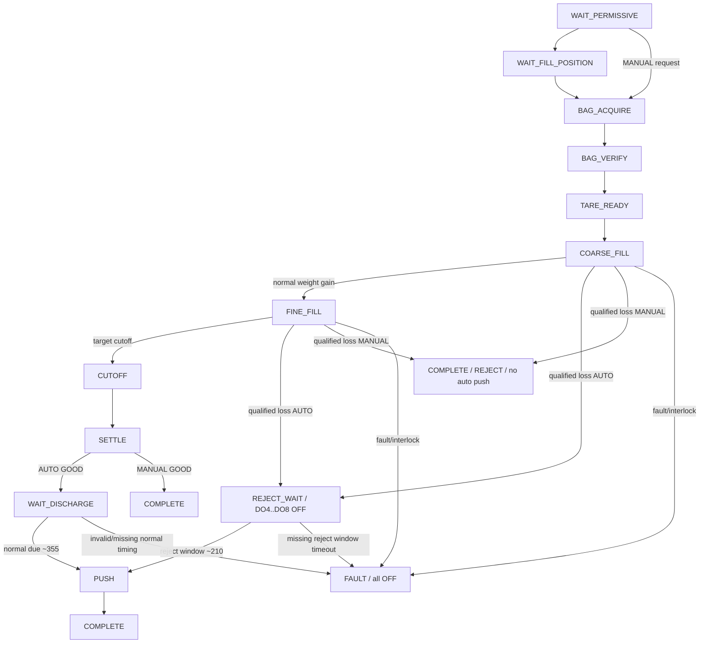
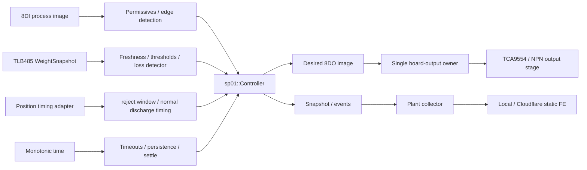

# SP01 Canonical Engineering Views

Status: canonical working view pack for commissioning branch `diag/sp01-g2-g9`.

The project now treats **V1..V11 as the core canonical engineering views**. V12 and V13 remain commissioning extensions because weighing-quality/calibration and eight-spout topology are important, but they do not change the eleven-view control language.

Historical Yellow/Purple/Red-team material and the older `SP01_ENGINEERING_VIEWS.md` are review context only.

## Ground-truth precedence

When two representations disagree, use this order:

```text
1. measured installed-machine electrical/mechanical/process evidence
2. executable C++ controller + board adapter
3. frozen I/O / weighing / reject / topology contracts
4. this canonical view pack
5. generated HMI/diagram projections
6. historical team proposals
```

Current process truths used here:

```text
controller       ESP32-S3 / ESP-IDF / C++17 / FreeRTOS
one controller   one spout; SP01 is not master of SP02..SP08
weight           load cell -> LAUMAS TLB485 -> isolated RS485 -> WeightSnapshot
I/O              8DI + 8DO; no continuous-weight DI
broken bag       qualified measured-weight loss while filling is active
on broken bag    latch REJECT and remove DO4..DO8 filling energy in the same decision
reject route     AUTO: wait reject window near 210 deg -> DO3 push -> no later 355 deg push
good route       AUTO: skip reject window -> normal A/B timing -> DO3 push near 355 deg
manual reject    latch REJECT, remove DO4..DO8, complete without automatic eject
push actuator    semantic DO3 = bag.push for both automatic routes
cloud/HMI        supervisory; never owns cutoff/interlock/eject timing
```

Numeric detector thresholds, the real 210/355 timing windows and actuator lead remain commissioning values until G4/G8 evidence freezes them.

## Core 11-view review status

`COMPLETE` means the view itself is internally reconciled with current executable code and known bench evidence. It does **not** mean every physical commissioning gate is complete.

| View | Review | Runtime / evidence boundary |
|---|---|---|
| V1 Runtime timeline | COMPLETE | full event producer is still partial; collector currently records a subset of semantic changes |
| V2 State/process matrix | COMPLETE | matches current `sp01::Controller` behavior |
| V3 Routing flow | COMPLETE | real installed 210-degree adapter remains G8 evidence |
| V4 Predicates | COMPLETE | corrected to current high-water/persistence detector; production threshold still disabled/unfrozen |
| V5 Authority graph | COMPLETE | central collector/HMI is read-only supervisory |
| V6 Executable engine | COMPLETE | active G2 bench firmware is a commissioning artifact, not production authority |
| V7 Physical I/O | COMPLETE as map | G2 DI1..DI8 PASS; physical DO evidence remains active |
| V8 Fault/reject matrix | COMPLETE | AUTO and MANUAL reject behavior separated |
| V9 Supervisory projection | COMPLETE | projection only; not a second FSM |
| V10 Communication/data contract | COMPLETE | `desired_do` and `commanded_do` are distinct; true physical DO sensing is not currently published |
| V11 Digital-twin/HMI | COMPLETE as UI contract | live values appear only when telemetry exists; missing values remain unavailable |

---

## V1 — Runtime Timeline

Purpose: one monotonic evidence axis for control, weighing, I/O and bag disposition.

Canonical row:

```text
t_us | spout_id | cycle_id | mode | state | fault | disposition |
DI[7:0] | desired_DO[7:0] | commanded_DO[7:0] | physical_DO[7:0]? |
weight_kg | weight_quality | stable | event
```

`physical_DO` is optional because the current board/API reports controller desired output and board command, not an independent electrical feedback measurement.

Required event classes for final commissioning evidence:

```text
boot / reset_reason
state_enter
DI_change / desired_DO_change / commanded_DO_change
weight_sample / weight_stale / weight_recovered
coarse_to_fine / normal_cutoff
broken_bag_candidate / broken_bag_detected
fill_energy_off / reject_latched
reject_window / reject_push_on / reject_push_off
normal_discharge_ref_a / ref_b / normal_push_on / normal_push_off
complete / fault / fault_clear
network_link_down / network_link_up
```

Current collector coverage is intentionally smaller: it records discovery/online and changes to mode, state, fault, disposition, cycle_id, DI, desired/commanded DO and broken-bag detection timestamp. That subset is useful for V11 but is not yet the complete V1 evidence stream.

REJECT ordering must be visible:

```text
qualified measured loss
-> detector accepted
-> disposition REJECT latched
-> DO4..DO8 absent from the same returned output image
-> AUTO only: reject window near 210 deg
-> DO3 pulse once
-> no later normal 355 deg pulse
```

GOOD ordering:

```text
normal fill -> cutoff -> settle/stable -> GOOD
-> normal A/B discharge timing -> DO3 pulse near 355 deg
```

MANUAL reject ordering:

```text
qualified measured loss -> REJECT latched -> DO4..DO8 OFF -> COMPLETE
(no automatic DO3 eject)
```

Bench status relevant to V1: G2 one-hour USB/Ethernet soak PASS; physical DI1..DI8 PASS; physical DO loopback evidence is active in `evidence/SP01/2026-09-10/G2/RESULT.md`.

---

## V2 — State / Process Matrix

Purpose: primary human-readable sequential logic view. It must match `sp01::Controller`.

| State | Main condition / transition | Current output image |
|---|---|---|
| `WAIT_PERMISSIVE` | AUTO waits permissives; MANUAL waits request | all OFF |
| `WAIT_FILL_POSITION` | AUTO armed fill-position edge -> `BAG_ACQUIRE` | all OFF |
| `BAG_ACQUIRE` | bag present -> `BAG_VERIFY`; timeout -> `BAG_MISSING` | DO1 scanner + DO2 bag-detect air |
| `BAG_VERIFY` | retained bag -> `TARE_READY` | DO1 + DO2 |
| `TARE_READY` | fresh GOOD weight -> `COARSE_FILL` | DO1 + DO2 |
| `COARSE_FILL` | normal threshold -> `FINE_FILL`; qualified loss -> AUTO `REJECT_WAIT`, MANUAL `COMPLETE` | DO1 + DO2 + DO4..DO8; detector decision removes DO4..DO8 immediately |
| `FINE_FILL` | cutoff threshold -> `CUTOFF`; qualified loss -> AUTO `REJECT_WAIT`, MANUAL `COMPLETE` | DO1 + DO2 + DO4 + DO6 + DO7 + DO8; detector decision removes DO4..DO8 immediately |
| `CUTOFF` | immediate -> `SETTLE` | DO1 + DO2; DO4..DO8 OFF |
| `SETTLE` | stable after minimum settle -> GOOD; MANUAL `COMPLETE`, AUTO `WAIT_DISCHARGE` | DO1 + DO2; fill energy OFF |
| `REJECT_WAIT` | AUTO REJECT latched; reject window -> `PUSH`; timeout -> fault | DO1 + DO2; DO3 OFF; DO4..DO8 OFF |
| `WAIT_DISCHARGE` | GOOD only; A/B timing produces due time -> `PUSH` | DO1 + DO2; fill energy OFF |
| `PUSH` | AUTO pulse for selected GOOD/REJECT route | DO3 only |
| `COMPLETE` | cycle increments; next cycle re-arms | all OFF |
| `FAULT` | latched controller/measurement fault | all OFF |

Disposition model:

```text
UNDECIDED  during acquisition/fill before final classification
GOOD       after successful normal settle
REJECT     immediately when broken-bag detector is accepted
```

Important output distinction: the confirmed immediate broken-bag action is **DO4..DO8 OFF**. Current executable logic retains DO1 and DO2 through `REJECT_WAIT`; no additional machine behavior for DO1/DO2 is assumed without G8 evidence.

---

## V3 — Interlock / Routing Flow

Purpose: explain allowed paths and first blocking condition.



The semantic reject-window input exists in the controller model, but the real installed-machine adapter that produces that window is intentionally not frozen until G8.

---

## V4 — Interlock Predicates

Purpose: compact review equations; not a second controller implementation.

```text
AUTO_PERMISSIVE = DI1 & DI2 & DI3 & DI4
MANUAL_REQUEST  = DI1 & DI4
BAG_PRESENT     = DI6
WEIGHT_FRESH    = quality==GOOD && sample_time<=now && age<=weight_stale_us
CUTOFF_REACHED  = net_kg >= target_kg - cutoff_margin_kg
FILL_ACTIVE     = state in {COARSE_FILL,FINE_FILL}
```

Current executable broken-bag detector is a **running high-water loss + persistence detector**, not a finite-window derivative:

```text
DETECTOR_ENABLED = broken_bag_loss_trip_kg > 0
                   && broken_bag_persist_us > 0

on each NEW WeightSnapshot.sequence while FILL_ACTIVE and WEIGHT_FRESH:
    peak_kg = max(peak_kg, net_kg)
    loss_kg = peak_kg - net_kg

LOSS_ACTIVE = loss_kg >= broken_bag_loss_trip_kg
BROKEN_BAG  = LOSS_ACTIVE persists for broken_bag_persist_us
```

Repeated controller ticks over one unchanged weight sample cannot manufacture persistence evidence.

Routing predicates:

```text
REJECT_PUSH_ALLOWED = disposition==REJECT && mode==AUTO && reject_window
NORMAL_PUSH_ALLOWED = disposition==GOOD && mode==AUTO && normal_discharge_due
```

State-derived rules:

```text
COARSE: DO1+DO2+DO4+DO5+DO6+DO7+DO8 ON
FINE:   DO1+DO2+DO4+DO6+DO7+DO8 ON
REJECT accepted: DO4..DO8 OFF in the same returned controller output image
PUSH:   DO3 ON only in AUTO after the selected route becomes due
FAULT:  all outputs safe image
```

No Karnaugh map is canonical for this timed sequential machine.

---

## V5 — Logic Dependency / Authority Graph

Purpose: show what may influence real-time outputs and what may only observe them.



Authority rules:

```text
Controller + local I/O task   real-time process authority
Plant collector               read-only aggregation
Engineering console           supervisory visualization
Cloud/WAN                     optional; never required for cutoff/interlock/eject timing
```

The collector exposes GET/SSE only; it does not contain actuator write routes.

---

## V6 — Executable Engine / Ground Truth

Canonical control engine:

```text
firmware/esp32-s3/components/controller/include/sp01/model.hpp
firmware/esp32-s3/components/controller/include/sp01/controller.hpp
firmware/esp32-s3/components/controller/controller.cpp
```

Current executable reject model includes:

```text
BagDisposition {UNDECIDED, GOOD, REJECT}
State::RejectWait
PositionSnapshot.reject_window
running high-water loss detector + new-sample persistence
same-tick transition from fill state to RejectWait in AUTO
same-tick transition from fill state to Complete in MANUAL reject
DO4..DO8 absent from RejectWait/Complete output image
DO3 only when AUTO route due
normal A/B discharge timing remains separate for GOOD bags
```

The detector defaults disabled until measured G4/G8 values are supplied. `reject_wait_timeout_us` is likewise part of the all-zero/all-configured commissioning set.

`firmware/esp32-s3/main/app_main.cpp` is the production integration target, but during G2 the branch deliberately compiles a focused commissioning diagnostic (`g2_do_seq.cpp`). That bench artifact must not be mistaken for the production controller engine.

The current production integration does not yet supply a real `PositionSnapshot.reject_window`; the default semantic value remains false until the G8 adapter is frozen.

Host/Python simulation is conformance/reference only, not process authority.

---

## V7 — Physical I/O / Terminals

Canonical board map: `BOARD_TERMINALS.md`.

```text
DI1 hopper.feeder_running
DI2 downstream.conveyor_ready
DI3 machine.motor_running
DI4 process.initiative
DI5 cycle.fill_position
DI6 bag.present
DI7 position.discharge_ref_a
DI8 position.discharge_ref_b

DO1 scanner.down
DO2 bag_detect_air
DO3 bag.push
DO4 dosing.valve_a
DO5 dosing.valve_b
DO6 dosing.valve_c
DO7 filling.motor
DO8 spout.aeration

load cell -> TLB485 -> isolated RS485 -> WeightSnapshot
```

Input bench truth now proven on the physical SP01 board:

```text
passive dry-contact test: DICOM floating, DGND <-> selected DIx
DI1..DI8: PASS, one expected bit at a time, return to 0xFF, no observed adjacent-bit cross-talk
```

Current G2 DO test uses the board DI channels as a low-current loopback indicator/load so that each DO may be verified one-hot without connecting machine actuators. This proves switching/selection on the bench, not 24 V production-load current or thermal margin.

The DO stage is NPN open-collector/sinking. Do not describe `DOx` as a +24 V source.

Broken-bag detection consumes no ninth DI. Both automatic eject routes use semantic DO3 at different timing windows.

---

## V8 — Exception / Fault / Reject Matrix

Purpose: keep controlled process reject separate from controller/equipment faults.

| Condition | Classification | Immediate result | Later route |
|---|---|---|---|
| Qualified loss while filling, AUTO | `REJECT` disposition | DO4..DO8 OFF immediately | wait semantic reject window; one DO3 push near 210 deg |
| Qualified loss while filling, MANUAL | `REJECT` disposition | DO4..DO8 OFF immediately | `COMPLETE`; no automatic DO3 push |
| Healthy fill + stable final weight, AUTO | `GOOD` disposition | normal cutoff/settle | normal A/B timing; DO3 push near 355 deg |
| Healthy fill + stable final weight, MANUAL | `GOOD` disposition | normal cutoff/settle | `COMPLETE`; no automatic DO3 push |
| `PERMISSIVE_LOST` | fault | all OFF | explicit recovery |
| `BAG_MISSING` / `BAG_LOST` | fault | all OFF | explicit recovery |
| `WEIGHT_STALE` / `WEIGHT_FAULT` | fault | all OFF | restore weighing |
| `STATE_TIMEOUT` | fault | all OFF | diagnose process/timing |
| `IO_FAULT` | fault | all OFF | diagnose I/O |
| `DISCHARGE_TIMING_INVALID` | fault | all OFF | diagnose A/B timing |
| `MODE_CHANGED` during active cycle | fault | all OFF | explicit recovery |

Reject invariants:

```text
REJECT cannot silently revert to GOOD in the same cycle
REJECT never reopens DO4..DO8 before cycle completion
AUTO REJECT does not later receive the GOOD ~355 deg push
AUTO GOOD does not receive the reject ~210 deg push
measurement uncertainty/fault is not silently converted into REJECT
```

---

## V9 — Supervisory State Projection

Purpose: operator macro state only; never re-implements transition logic.

```text
IDLE       WAIT_PERMISSIVE / WAIT_FILL_POSITION
RUNNING    BAG_ACQUIRE / BAG_VERIFY / TARE_READY / COARSE_FILL / FINE_FILL / CUTOFF / SETTLE
REJECTING  REJECT_WAIT, and PUSH when disposition==REJECT
DISCHARGE  WAIT_DISCHARGE, and PUSH when disposition==GOOD
COMPLETE   COMPLETE
FAULTED    FAULT
```

Do not classify every `PUSH` as normal discharge; disposition determines whether it is reject or normal ejection.

---

## V10 — Communication / Data Contract

### Local control path

```text
TLB485 -> WeightSnapshot -> Controller
8DI -> InputImage -> Controller
position adapter -> PositionSnapshot -> Controller
Controller -> ControllerSnapshot + desired OutputImage
board-output owner -> commanded OutputImage -> TCA9554
```

Terminology:

```text
desired_do    output image requested by the controller FSM
commanded_do  output image last commanded to the board adapter
physical_do   independent electrical feedback, only if future hardware actually measures it
```

Do not label `commanded_do` as physically proven ON/OFF.

### Current embedded `/api/state`

Current semantic fields include:

```text
mode, state, fault, disposition, cycle_id
weight, stable, quality, weight_sequence, weight_sample_time_us
di, desired_do, commanded_do
broken_bag_detected_us, broken_bag_peak_kg, broken_bag_weight_kg
discharge_ref_interval_us, discharge_due_us
service_ready, bench_do_available
tlb_polls, tlb_errors, tlb_last_error
```

### Plant collector

The collector polls spout endpoints, normalizes aliases, adds `schema_version=1`, stores latest snapshots and semantic change events, and exposes read-only:

```text
GET /healthz
GET /api/v1/spouts
GET /api/v1/spouts/{id}
GET /api/v1/spouts/{id}/events
GET /api/v1/live        (SSE)
```

The collector has no POST/write actuator routes.

### Local service plane

The embedded controller may expose separately authorized service operations such as calibration and G2 bench DO pulse when the corresponding build option is enabled. Those are local service functions with token/interlock checks; they are not central/cloud process authority.

Future telemetry may add identity/system/network fields such as firmware SHA, config revision, uptime, reset reason, heap and IP. V11 must show them as unavailable until they are actually published.

---

## V11 — Industrial Digital Twin / Web HMI

Purpose: one browser composite for commissioning and maintenance, with the other core views as drill-downs.

Canonical top-level layout:

```text
+--------------------------------------------------------------------------------+
| SP01 | MODE | STATE | FAULT | DISPOSITION | CYCLE | FW SHA? | LINK?           |
+--------------------------------------+-----------------------------------------+
| Process / selected route             | Weight / time                           |
| GOOD ~355 vs REJECT ~210             | measured net kg; no fake dW/dt           |
+--------------------------------------+-----------------------------------------+
| State / routing strip                | Interlocks / first blocker              |
| current core state highlighted       | permissive / bag / weight / position    |
+--------------------------------------+-----------------------------------------+
| DI1..8                               | desired DO1..8 / commanded DO1..8       |
+--------------------------------------+-----------------------------------------+
| TLB diagnostics / collector age / online state / reset/network if published   |
+--------------------------------------------------------------------------------+
| V1 event history / fault + reject evidence                                    |
+--------------------------------------------------------------------------------+
```

Truth-state convention for every metric:

```text
MEASURED/REPORTED   value directly supplied by firmware/collector
DERIVED             deterministic display projection from reported fields
CONFIGURED          value from an identified configuration source
UNAVAILABLE         not published / not measured; never replaced by fake data
```

UI rules:

```text
V11 is the default composite page
V1..V10 are drill-down tabs/panels, not separate competing applications
V12/V13 are extension tabs
GOOD and REJECT routes are visually distinct
PUSH is colored/classified using disposition, not state name alone
desired_do and commanded_do are labeled separately
physical DO is never inferred from commanded_do
loss of collector/browser/WAN must not imply loss of local controller authority
```

Current static engineering console lives at `web/engineering-console/index.html` and consumes the read-only collector REST/SSE API. It must continue to render missing telemetry as unavailable.

---

# Extension V12 — Weighing Signal Quality / Calibration / Tare

Purpose: own measurement evidence needed by cutoff and broken-bag threshold commissioning.

Keep separate:

```text
calibration zero/span     TLB/load-cell measurement chain
cycle tare                runtime offset if later adopted
recipe target             production target/compensation
```

G4/G5/G8 characterize or freeze TLB filter/profile, update rate, latency/jitter, vibration/noise, stability semantics, loss-noise envelope, detector threshold/persistence and calibration checks.

The current detector is high-water/persistence. A future finite-window/dW/dt method would be a new validated algorithm, not an alternate description of current code.

---

# Extension V13 — Eight-Spout / Rotating-Stationary Topology

Purpose: whole-machine topology.

```text
ROTATING
SP01  SP02  SP03  SP04  SP05  SP06  SP07  SP08
 |     |     |     |     |     |     |     |
local independent controller + TLB + I/O per spout

             supervisory telemetry
                      |
                      v
STATIONARY plant collector / local HMI
                      |
               optional outbound path
                      |
                      v
Cloudflare-hosted static FE
```

Rules:

```text
no spout controller is master for another spout
loss of central HMI/cloud does not own local cutoff/interlock/eject timing
each event carries spout_id + cycle_id
central view correlates eight spouts but does not time DO3/DO4..DO8
slip-ring data dependency is not assumed until as-built evidence requires it
```

---

# Gate mapping

The views are commissioning instruments, not artwork.

```text
G0   V6 build/tests
G1   V7 + V10 safe board bring-up
G2   V1 + V7 physical 8DI/8DO + Ethernet evidence
G2T  V1 + V7 + V10 thermal/serviceability evidence
G3   V2 + V3 + V4 + V6 + V8 deterministic dry FSM including GOOD/REJECT paths
G4   V1 + V10 + V12 TLB transport/noise/detector evidence
G5   V10 + V12 calibration evidence
G6   V5 + V10 + V11 prove loss of browser/network does not own local control
G7   reconcile core V1..V11 plus extensions required by the affected gate
G8   V1 + V7 + V8 + V11 + V12 + V13 shadow against legacy machine, physical DO isolated
G9   V1 + V8 + V11 controlled one-spout live pilot with rollback and accepted GOOD/REJECT behavior
```

## Current commissioning boundary

Software/CI may prove executable behavior and prepare views. It cannot substitute for physical evidence required by G2, G2T, G4, G5, G8 or G9.

As of the current bench sequence:

```text
G2 sustained USB/Ethernet soak   PASS
G2 DI1..DI8 physical truth      PASS
G2 DO physical/loopback truth   ACTIVE
G2 reset/restart safe outputs   PENDING
```

Until G8 freezes the installed position method, `PositionSnapshot.reject_window` is a semantic adapter boundary, not a claim that a new 210-degree sensor or ninth DI exists.
