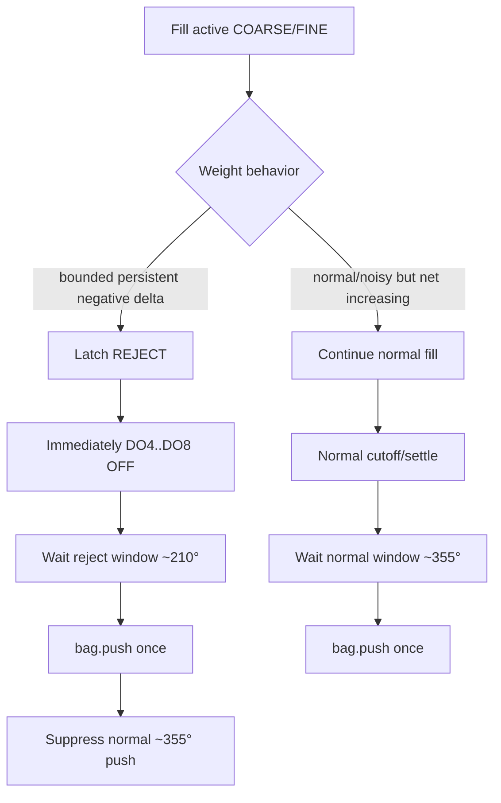
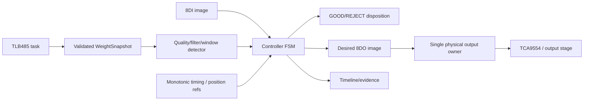
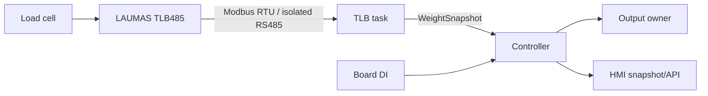

# SP01 Canonical Engineering Views

This document is the common engineering view pack for design review, commissioning, HMI and long-term maintenance.

## Ground-truth and precedence

```text
1. measured installed-machine process/electrical/mechanical evidence
2. executable ESP32-S3 C++ controller + board adapter
3. frozen I/O / weighing / reject / topology contracts
4. generated state/fault/timeline views
5. supervisory/HMI projections
6. historical team proposals
```

A confirmed machine behavior may expose a software gap. In that case the view records the required behavior and the relevant gate remains open until executable code and evidence catch up.

Current platform:

```text
ESP32-S3 / ESP-IDF / C++ / FreeRTOS
8DI + 8DO process image
LAUMAS TLB485 digital weight over isolated RS485
one independent controller per spout
```

Python/HX711/K-map material is not production ground truth.

---

## V1 — Runtime Timeline

Purpose: one monotonic timeline for process evidence.

Canonical row:

```text
t_us | spout_id | cycle_id | mode | state | disposition | fault |
DI[7:0] | desired_DO[7:0] | physical_DO[7:0] |
weight_raw | weight_filtered | weight_quality | event
```

Required event classes include:

```text
boot/reset
state transition
DI/DO transition
weight sample
coarse->fine
normal cutoff
broken-bag detector decision
reject latch
immediate reject fill shutdown
reject due / push on / push off ~210°
normal due / push on / push off ~355°
fault/fault-clear
TLB stale/recovered
network link/IP events
```

For a REJECT cycle V1 must make this sequence visually obvious:

```text
weight falling during fill
-> detector accepts broken bag
-> DO4..DO8 OFF immediately
-> REJECT remains latched
-> one push near ~210°
-> no later push near ~355°
```

---

## V2 — State / Process Logic Matrix

Purpose: primary human-readable logic view.

The current healthy path remains:

```text
WAIT_PERMISSIVE
-> WAIT_FILL_POSITION
-> BAG_ACQUIRE
-> BAG_VERIFY
-> TARE_READY
-> COARSE_FILL
-> FINE_FILL
-> CUTOFF
-> SETTLE
-> WAIT_DISCHARGE
-> PUSH
-> COMPLETE
```

Installed-machine requirement adds a controlled reject branch from the active filling states:

| Phase | Normal condition | Broken-bag condition | Required action |
|---|---|---|---|
| `COARSE_FILL` | weight progresses toward coarse threshold | bounded negative weight delta accepted | latch `REJECT`; immediately remove DO4..DO8 |
| `FINE_FILL` | weight progresses toward cutoff | bounded negative weight delta accepted | latch `REJECT`; immediately remove DO4..DO8 |
| post-detection | `GOOD` | `REJECT` | keep fill outputs OFF; wait disposition-specific eject window |
| ~210° | GOOD | REJECT | GOOD: no push; REJECT: one `bag.push` |
| ~355° | GOOD | REJECT | GOOD: one normal `bag.push`; REJECT: suppress push |

`REJECT` is a controlled bag disposition, not automatically a controller-wide fault.

Current executable controller does not yet contain this full reject branch; G3 therefore stays open.

---

## V3 — Interlock / Process Flow



The detector must use validated TLB weight data. HMI/network is never a control dependency.

---

## V4 — Interlock Predicates / Equations

K-map is non-canonical. Keep only predicates that help review the sequential FSM.

```text
AUTO_PERMISSIVE = DI1 & DI2 & DI3 & DI4
MANUAL_REQUEST  = DI1 & DI4
BAG_PRESENT     = DI6
WEIGHT_FRESH    = quality==GOOD && age<=weight_stale_us
CUTOFF_REACHED  = net_kg >= target_kg - cutoff_margin_kg

FILL_ACTIVE     = state in {COARSE_FILL, FINE_FILL}
NEGATIVE_DELTA  = filtered_W(now) - filtered_W(now-window) < -loss_trip
BROKEN_BAG      = FILL_ACTIVE && WEIGHT_FRESH && NEGATIVE_DELTA && persistence_ok
```

When `BROKEN_BAG` is accepted:

```text
DISPOSITION = REJECT   [latched for this cycle]
DO4 = OFF
DO5 = OFF
DO6 = OFF
DO7 = OFF
DO8 = OFF
```

Detector window, threshold, filtering and persistence are frozen from G4/G8 evidence.

---

## V5 — Logic Dependency Graph



No network task owns physical outputs.

---

## V6 — Executable Engine

Canonical implementation:

```text
firmware/esp32-s3/components/controller/include/sp01/model.hpp
firmware/esp32-s3/components/controller/include/sp01/controller.hpp
firmware/esp32-s3/components/controller/controller.cpp
```

Required properties:

```text
deterministic
monotonic timing
single physical-output owner
nonblocking weight transport
bounded stale/fault handling
```

Known gap at this review:

```text
no complete finite-window broken-bag detector
no latched GOOD/REJECT disposition
no immediate DO4..DO8 reject shutdown path
no explicit ~210° reject scheduling
no suppression of later ~355° push after reject
```

G3 cannot PASS until V6 matches V2/V3/V4 for this process behavior.

---

## V7 — Physical I/O and Terminals

Canonical terminal mapping is `BOARD_TERMINALS.md`.

```text
DI1..DI8 -> InputImage
TLB485 -> isolated RS485 -> WeightSnapshot
Controller OutputImage -> TCA9554/NPN sinking stage -> DO1..DO8
```

Relevant outputs:

```text
DO3 bag.push
DO4 dosing.valve_a
DO5 dosing.valve_b
DO6 dosing.valve_c
DO7 filling.motor
DO8 spout.aeration
```

Broken-bag detection does not consume a ninth DI; it is derived from weight while filling.

---

## V8 — Exception / Fault / Reject Matrix

Controlled process reject and controller faults are separate concepts.

| Class | Trigger | Result |
|---|---|---|
| Controlled `REJECT` | accepted negative weight delta during active fill | DO4..DO8 OFF immediately; reject at ~210°; suppress ~355° push |
| `PERMISSIVE_LOST` | active-cycle permissive lost | FAULT, safe output image |
| `BAG_MISSING` | bag acquisition/verify fails | FAULT |
| `BAG_LOST` | bag-present input disappears in required state | FAULT |
| `WEIGHT_STALE` | fresh weight unavailable | FAULT |
| `WEIGHT_FAULT` | TLB/weight quality fault | FAULT |
| `STATE_TIMEOUT` | configured deadline exceeded | FAULT |
| `IO_FAULT` | explicit I/O integrity fault | FAULT |
| `DISCHARGE_TIMING_INVALID` | invalid reference/timing | FAULT |
| `MODE_CHANGED` | mode changes during active cycle | FAULT |

A reject detector failure/uncertain weight quality must not be silently treated as a valid REJECT classification; use the defined measurement fault path.

---

## V9 — Supervisory Projection

Use a simple operator-level projection only:

```text
IDLE
RUNNING
REJECTING
COMPLETE
FAULTED
```

This is an HMI projection, not a second FSM and not a claim of full ISA-88 compliance.

---

## V10 — Communication / Data Contracts



Semantic data required for evidence/HMI:

```text
identity: firmware_sha, spout_id, config_revision
control: mode, state, disposition, fault, cycle_id
I/O: di_bits, desired_do_bits, physical_do_bits where available
weight: raw/filtered net_kg, age, stable, quality, sequence
reject detector: delta, window, threshold, persistence, decision timestamp
position: reject_due, normal_due, reference validity
network/system: link, IP, uptime, heap, reset reason
```

No invented controller Modbus register table is canonical.

---

## V11 — Industrial Digital-Twin HMI

Recommended operator/service layout:

```text
+--------------------------------------------------------------------------------+
| SP01 | MODE | STATE | GOOD/REJECT | FAULT | CYCLE | FW | LINK/IP              |
+--------------------------------------+-----------------------------------------+
| Process schematic                    | Weight / time                           |
| active dosing/motor/aeration         | raw + filtered + detector window        |
+--------------------------------------+-----------------------------------------+
| State/disposition strip              | Interlocks / detector decision          |
| GOOD -> 355 / REJECT -> 210          | first blocking/trigger condition        |
+--------------------------------------+-----------------------------------------+
| DI1..8 / desired + physical DO1..8   | TLB / heap / reset / network            |
+--------------------------------------+-----------------------------------------+
| Event timeline: detection -> fill OFF -> 210/355 push                         |
+--------------------------------------------------------------------------------+
```

Truthfulness rule: only show a metric as live if firmware actually publishes or derives it from validated data. No decorative pseudo-live `dW/dt`, rotor angle or prediction.

---

## V12 — Weighing Signal Quality / Calibration / DSP / Tare

Canonical detail: `WEIGHING_SIGNAL_QUALITY.md` and `CALIBRATION.md`.

This view owns:

```text
TLB filter profile
sample/update rate
latency/jitter
zero and dynamic noise
finite-window negative-delta noise envelope
calibration evidence
bounded cycle-tare design if later used
broken-bag detector threshold derivation
```

Calibration, target compensation and cycle tare remain separate concepts.

---

## V13 — Eight-Spout / Rotating-Stationary Topology

Canonical detail: `EIGHT_SPOUT_SYSTEM_TOPOLOGY.md`.

```text
8 spouts = 8 peer controllers
one controller owns exactly one spout
central HMI is supervisory
```

For reject handling, the essential identity is local and unambiguous:

```text
spout_id + cycle_id + disposition
```

A REJECT must remain attached to the correct rotating spout until the ~210° eject action is completed. It must not migrate to a neighboring/next cycle because of network or supervisory correlation.

---

## Gate mapping

```text
G2   V1 + V7
G2T  V1 + V7 + V10 + V13
G3   V1 + V2 + V3 + V4 + V5 + V6 + V8 + V12
G4   V1 + V10 + V12
G5   V10 + V11 + V12
G6   V1 + V6 + V11
G7   V1..V13 canonical review
G8   V1 + V2 + V7 + V8 + V11 + V12 + V13
G9   V1 + V7 + V8 + V11 + V13
```

The detailed acceptance criteria and current status are maintained in `GATE_EXECUTION_PLAN.md`.

This view pack is the standard engineering language for the project. New team proposals are incorporated only when they improve these views or gate evidence.