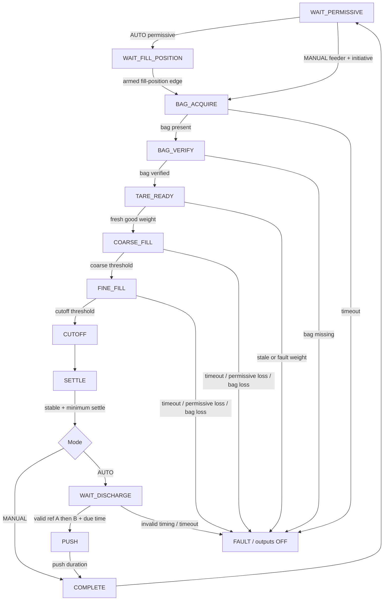
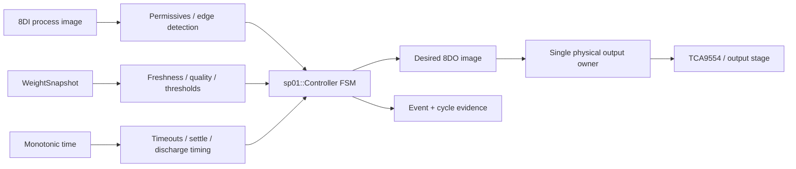
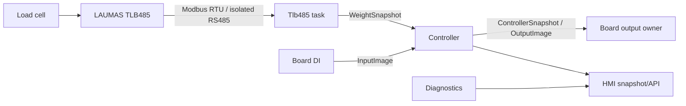

# SP01 Engineering Views

This document defines the canonical engineering-view set for SP01. It distills useful visualization patterns from the yellow-team Black Box proposal while rejecting its obsolete implementation assumptions.

## Ground-truth rule

The yellow-team material is **view inspiration, not executable truth**.

SP01 production ground truth remains:

```text
ESP32-S3 / ESP-IDF / C++17
8DI + 8DO board process image
LAUMAS TLB485 digital weight over isolated RS485
sp01::Controller state machine
BoardIo as the physical I/O adapter
```

Do not import these obsolete assumptions from the source proposal:

```text
Python asyncio as the production controller
raw load-cell/HX711 path
fixed 14.4 s cycle
fixed mechanical angles such as 340/355 deg
invented controller Modbus holding-register map
extra alarm/reject/vibrator outputs not present in the frozen 8DO allocation
EWMA/in-flight adaptation as an already-approved production algorithm
```

The view hierarchy is:

```text
V6 executable C++ + V7 I/O contract + V10 transport contracts
                    |
                    v
              V2 state matrix
             /   |      \
            v    v       v
          V3    V4      V5
                    |
                    v
              V1 runtime evidence
                    |
                    v
              V11 digital twin

V8 fault matrix cuts across V2/V3/V6.
V9 is an operations/supervisory projection of V2, not a second controller FSM.
```

---

## View 1 — Runtime Timeline

**Decision: ADOPT, but measurement-driven.**

The useful idea is to place state, DI, DO and weight on one monotonic time axis. Do not hard-code a nominal cycle duration or rotor angle before G8 measurements.

Canonical trace row:

```text
t_us | cycle_id | state | fault | DI[7:0] | DO[7:0] |
weight_kg | stable | weight_quality | event
```

Minimum events:

```text
boot
state_enter
DI_change
DO_change
weight_sample
coarse_to_fine
cutoff
settle_stable
discharge_ref_a_rise
discharge_ref_b_rise
discharge_due
push_on
push_off
complete
fault
fault_clear
network_link_down/up
TLB_stale/recovered
```

The default operator plot should show:

```text
weight vs time
state band
DI transition markers
DO transition markers
coarse threshold
target/cutoff threshold
discharge A/B timing
```

Rotor angle is an **optional derived view** only after the machine relationship between references and physical angle is measured and frozen.

---

## View 2 — State Logic Matrix

**Decision: ADOPT as the primary human-readable logic view.**

This matrix must be generated/reviewed against `sp01::Controller`, never maintained as independent logic.

| State | Entry/active condition | Main transition | Output image |
|---|---|---|---|
| `WAIT_PERMISSIVE` | reset, complete, safe idle | AUTO: all four permissives -> `WAIT_FILL_POSITION`; MANUAL: feeder + initiative -> `BAG_ACQUIRE` | all OFF |
| `WAIT_FILL_POSITION` | AUTO permissive available | armed fill-position edge -> `BAG_ACQUIRE` | all OFF |
| `BAG_ACQUIRE` | fill cycle requested | bag present -> `BAG_VERIFY`; timeout -> fault | scanner + bag-detect air |
| `BAG_VERIFY` | bag detected | verified bag -> `TARE_READY`; missing -> fault | scanner + bag-detect air |
| `TARE_READY` | bag retained | fresh good weight -> `COARSE_FILL`; stale/fault weight -> fault | scanner + bag-detect air |
| `COARSE_FILL` | valid weight | weight >= coarse threshold -> `FINE_FILL`; timeout -> fault | scanner, bag air, A+B+C dosing, fill motor, aeration |
| `FINE_FILL` | valid weight | weight >= target-cutoff-margin -> `CUTOFF`; timeout -> fault | scanner, bag air, A+C dosing, fill motor, aeration |
| `CUTOFF` | cutoff reached | immediate -> `SETTLE` | scanner + bag-detect air |
| `SETTLE` | fill stopped | stable fresh weight after settle minimum -> MANUAL `COMPLETE`, AUTO `WAIT_DISCHARGE` | scanner + bag-detect air |
| `WAIT_DISCHARGE` | AUTO only | valid A->B timing then due time -> `PUSH`; timeout/invalid timing -> fault | scanner + bag-detect air |
| `PUSH` | discharge due | push duration elapsed -> `COMPLETE` | bag push only in AUTO |
| `COMPLETE` | cycle complete | AUTO -> wait next fill position/permissive; MANUAL waits initiative OFF | all OFF |
| `FAULT` | any latched fault | explicit clear only under permitted condition | all OFF |

Global rules from the controller:

```text
mode change during a non-idle cycle -> MODE_CHANGED fault
AUTO active-cycle permissive loss -> PERMISSIVE_LOST fault
MANUAL active fill + feeder loss -> PERMISSIVE_LOST fault
MANUAL initiative OFF during fill -> clean return to WAIT_PERMISSIVE
bag loss in bag-required states -> BAG_LOST fault
fault state -> safe output image
```

---

## View 3 — Interlock Flow

**Decision: ADOPT.**

Use this to explain why a transition is allowed or denied. It is not a replacement for V2/V6.



A UI implementation should highlight the active node, next enabled transitions and the first blocking interlock.

---

## View 4 — Interlock Equations

**Decision: KEEP THE INTENT, REPLACE THE K-MAP.**

A Karnaugh map is useful for small combinational logic. SP01 is a timed sequential FSM, so a K-map is not the canonical representation.

Useful equations are limited to simple predicates:

```text
AUTO_PERMISSIVE = DI1 & DI2 & DI3 & DI4
MANUAL_REQUEST  = DI1 & DI4
BAG_PRESENT     = DI6
WEIGHT_FRESH    = quality==GOOD && age<=weight_stale_us
CUTOFF_REACHED  = net_kg >= target_kg - cutoff_margin_kg
```

State-derived outputs are clearer and safer than direct DI->DO equations:

```text
DO1 scanner.down     = state in {BAG_ACQUIRE,BAG_VERIFY,TARE_READY,COARSE_FILL,
                                  FINE_FILL,CUTOFF,SETTLE,WAIT_DISCHARGE}
DO2 bag_detect_air   = same state set as DO1
DO3 bag.push         = state==PUSH && mode==AUTO
DO4 dosing.valve_a   = state in {COARSE_FILL,FINE_FILL}
DO5 dosing.valve_b   = state==COARSE_FILL
DO6 dosing.valve_c   = state in {COARSE_FILL,FINE_FILL}
DO7 filling.motor    = state in {COARSE_FILL,FINE_FILL}
DO8 spout.aeration   = state in {COARSE_FILL,FINE_FILL}
```

These equations are a review aid. `outputs_for_state()` remains executable truth.

---

## View 5 — Logic Dependency Graph

**Decision: ADOPT as a compact architecture/interlock view.**

Do not draw a literal gate network for the whole controller. Show dependencies instead:



This view is especially useful during code review because it makes the nonblocking boundary explicit: RS485/network tasks publish data; they do not own process outputs.

---

## View 6 — Executable Engine / Ground Truth

**Decision: ADOPT, but replace the yellow-team Python engine with current C++.**

Canonical files:

```text
firmware/esp32-s3/components/controller/include/sp01/model.hpp
firmware/esp32-s3/components/controller/include/sp01/controller.hpp
firmware/esp32-s3/components/controller/controller.cpp
```

Reference/simulation only:

```text
firmware/host/
py-sim/    (where retained)
```

Rule:

```text
Documentation views may explain or derive from V6.
No diagram/table is allowed to introduce a transition or output behavior absent from V6.
```

For commissioning, V6 must remain deterministic and use monotonic time. Adaptive in-flight/EWMA logic is a future design choice, not implicit behavior.

---

## View 7 — Physical I/O & Terminal Wiring

**Decision: ADOPT, using the actual Waveshare board contract.**

Canonical physical map is `docs/BOARD_TERMINALS.md`.

```text
Machine sensors -> board isolated DI1..DI8 -> InputImage
Controller OutputImage -> TCA9554 / NPN sinking stage -> DO1..DO8 -> field interface

Load cell bridge -> LAUMAS TLB485 -> isolated RS485 A+/B- -> WeightSnapshot
```

Do not show:

```text
raw load cell -> ESP/HX711
relay-contact outputs when the actual board uses sinking transistor outputs
unallocated OUT_REJECT / ALARM / vibrator outputs
```

V7 must always show both **terminal label** and **semantic name**.

---

## View 8 — Exception & Fault Matrix

**Decision: ADOPT and make it traceable to the `Fault` enum.**

| Fault | Detection | Controller result | Gate evidence |
|---|---|---|---|
| `PERMISSIVE_LOST` | required active-cycle permissive drops | enter `FAULT`, all outputs OFF | G3/G8 |
| `BAG_MISSING` | bag acquisition/verification fails | `FAULT`, all outputs OFF | G3 |
| `BAG_LOST` | bag disappears in bag-required state | `FAULT`, all outputs OFF | G3/G8 |
| `WEIGHT_STALE` | no fresh good WeightSnapshot | `FAULT`, all outputs OFF | G3/G4/G8 |
| `WEIGHT_FAULT` | TLB/weight quality reports fault | `FAULT`, all outputs OFF | G3/G4 |
| `STATE_TIMEOUT` | configured state deadline exceeded | `FAULT`, all outputs OFF | G3 |
| `IO_FAULT` | explicit I/O integrity failure | `FAULT`, all outputs OFF | G2/G3/G7 |
| `DISCHARGE_TIMING_INVALID` | invalid B-before-A or invalid discharge timing | `FAULT`, all outputs OFF | G3/G8 |
| `MODE_CHANGED` | AUTO/MANUAL changes during active cycle | `FAULT`, all outputs OFF | G3 |

Candidate diagnostics from the yellow-team proposal, **not current faults until designed and tested**:

```text
low dW/dt / possible burst bag
post-fill overweight classification
flow-degradation / blockage diagnostics
adaptive in-flight estimate
```

They may become diagnostics or future fault codes, but must not silently consume nonexistent output channels.

---

## View 9 — Supervisory / ISA-88-style Projection

**Decision: KEEP AS AN OPERATIONS VIEW, NOT AS THE SP01 FSM.**

The yellow-team view is useful for operators, but SP01 does not currently implement the full ISA-88 procedural state model. Do not claim ISA-88 compliance from this projection.

Suggested macro mapping:

| Supervisory state | SP01 detailed states |
|---|---|
| `STOPPED/OFF` | external power/machine state, outside current controller FSM |
| `IDLE` | `WAIT_PERMISSIVE`, `WAIT_FILL_POSITION` |
| `RUNNING` | `BAG_ACQUIRE` .. `PUSH` |
| `COMPLETE` | `COMPLETE` |
| `FAULTED` | `FAULT` |

`HOLDING/HELD/RESTARTING/ABORTING` are not implemented and must not be shown as active capabilities.

---

## View 10 — Memory / Communication / Data Map

**Decision: ADOPT THE MAP IDEA; REJECT THE INVENTED CONTROLLER MODBUS REGISTER TABLE.**

Current real contracts:



Upstream TLB register access belongs to the `tlb485` adapter and is documented separately. It must not be confused with a public SP01 controller register map.

Current/future controller-facing data should use semantic names rather than magic addresses:

```text
identity: firmware_sha, spout_id, config_revision
control: mode, state, fault, cycle_id
I/O: di_bits, desired_do_bits, physical_do_bits where available
weight: net_kg, sample_time_us, age_us, stable, quality, sequence
recipe: target_kg, coarse_to_fine_kg, cutoff_margin_kg
TLB: polls_ok, comm_errors, last_error, latency/jitter/recovery metrics
network: link, IP, HTTP/HMI health
system: uptime, reset_reason, free_heap, minimum_free_heap
```

If a controller Modbus/TCP or fieldbus server is added later, its address map becomes a versioned interface contract and gets its own document/tests.

---

## View 11 — Industrial Digital Twin HMI

**Decision: STRONGLY ADOPT.**

This is the most valuable composite view from the yellow-team proposal, but it must render **measured controller data**, not decorative pseudo-live values.

### Recommended screen

```text
+--------------------------------------------------------------------------------+
| SP01 | AUTO/MANUAL | STATE | FAULT | CYCLE | FW SHA | LINK/IP                 |
+--------------------------------------+-----------------------------------------+
| Process schematic                    | Weight / time                           |
| hopper -> dosing -> spout -> bag      | target / coarse / cutoff               |
| current active elements highlighted  | live trace + state bands                |
+--------------------------------------+-----------------------------------------+
| State / transition strip             | Interlocks                              |
| previous -> ACTIVE -> possible next  | permissive, bag, weight, timeout        |
+--------------------------------------+-----------------------------------------+
| DI1..DI8 / DO1..DO8 matrix           | Diagnostics                             |
| physical vs desired where available  | TLB age/errors, heap, reset, network    |
+--------------------------------------+-----------------------------------------+
| Event timeline / fault history / commissioning evidence                        |
+--------------------------------------------------------------------------------+
```

### Truthfulness rules

Only display a metric as live if firmware actually provides it.

Allowed now or directly derivable from current runtime:

```text
state / fault / mode / cycle_id
DI bitmap / DO bitmap
net weight / stable / quality
target and configured thresholds
TLB communication diagnostics
Ethernet status/IP
uptime / heap where instrumented
```

Do **not** display these as live until implemented and validated:

```text
dW/dt
in-flight weight
EWMA correction
rotor omega / degrees
predicted cutoff from a learned model
2000 BPH projection
```

The HMI should prefer 2D/vector process graphics and precise timelines over ornamental 3D.

### Commissioning mode

During `CONFIG_SP01_VIRTUAL_IO` builds:

```text
banner = VIRTUAL BENCH
physical DO authority = disabled
virtual DI and simulated weight = visually distinct
controller state/desired DO = real Controller output against simulated inputs
```

During G8 shadow:

```text
real DI = enabled
real TLB weight = enabled
physical DO = isolated
show desired DO as SHADOW only
compare timestamped legacy vs SP01 events
```

During G9 live pilot, only the locally authorized build/config may render physical DO as authoritative.

---

## View-source precedence

When two views disagree, use this order:

```text
1. measured physical/electrical evidence for the installed board
2. executable C++ controller and board adapter
3. frozen I/O / weighing interface documents
4. generated state/fault/timeline views
5. supervisory/operator projections
6. historical/yellow-team design material
```

## Integration into commissioning gates

```text
G2   V7 + V1 prove physical DI/DO mapping and safe reset behavior
G3   V2 + V3 + V4 + V5 + V8 prove the dry FSM/fault matrix
G4   V10 + V1 prove TLB transport timing/stale/recovery
G5   V10 + V11 present calibration evidence
G6   V11 proves HMI/network loss does not own control
G7   all canonical views consolidated as review evidence
G8   V1 + V7 + V11 run in shadow against the legacy machine
G9   V1 + V8 + V11 support controlled live acceptance and rollback review
```

The view set is therefore not separate documentation artwork; it is the common language connecting firmware, HMI, commissioning evidence and field troubleshooting.
